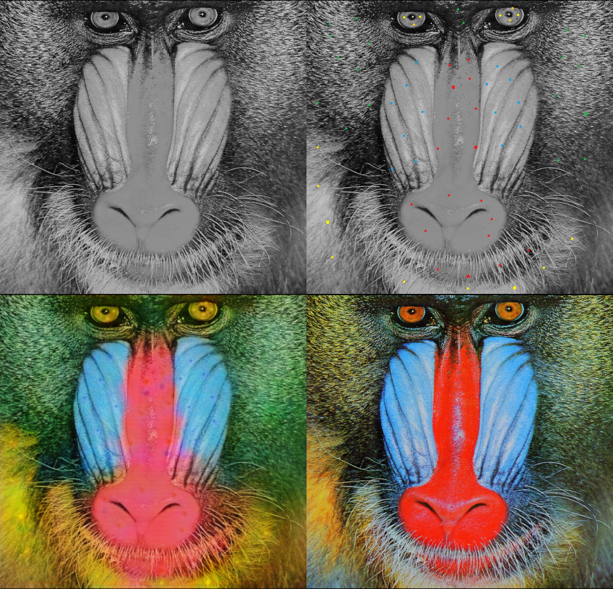

# pix2pix-automaticColorization
automatic colorization for black and white picture using pix2pix

pix2pix page: https://phillipi.github.io/pix2pix/

original paper: https://arxiv.org/abs/1611.07004

original implementation: https://github.com/phillipi/pix2pix

## Usage
put the images in the folder named "data". They are used for training. 

crop.py helps to randomly crop pictures from  the folder you asigned.

example
```
python crop.py pictures data
```
       
put the image in a folder named "val". They are used for validation.

example
```
python crop.py for_valid val
```

like this
```
main.py
pred.py
data
  ├ 000.jpg
  ├ aaa.png
  ...
  └ zzz.jpg
val
  ├ 111.jpg
  ├ bbb.png
  ...
  └ xxx.jpg
test
  ├ 222.jpg
  ├ ccc.png
  ...
  └ yyy.jpg 
```

To train
```
python main.py
```

To test
```
python pred.py test
```

## Result examples
upper left: black and white picure

upper right: given hints

under left: inference by pix2pix

under right: Ground Truth



